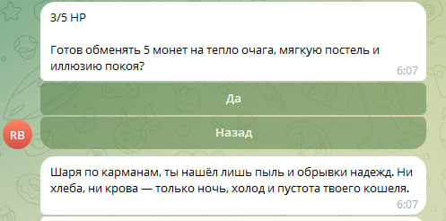

# Telegram Bot

## Описание

Этот Telegram-бот является текстовой рпг-игрой со встроенной моделью ИИ для генерации описаний окружения. Он построен на основе библиотеки `telegram-bot-simple`. Бот использует строгую типизацию для улучшения читаемости и надёжности кода.
По умолчанию бот использует API ChatGPT-4o-mini для улучшения качества описаний, но при необходимости бот поддерживает API Mistral (ИИ модели в открытом доступе). На всякий случай на сервере уже запущен Mistral.
Все действия каждого игрока логгируются и сохраняются в базе данных на SQLite.

### Основной функционал
- **Выбор класса персонажа:** пока только два класса персонажей — "Воин" и "Лучник".
- **Таверна:** встроенная ИИ модель автоматически генерирует описание происходящего в таверне для улучшения атмосферности.
- **Подземелье:** у игрока есть возможность из таверны спуститься в подземелье. Там с помощью ИИ модели генерируется противник.
- **Предметы и инвентарь:** В подземелье при победе над врагом есть шанс получить некоторые предметы.




## Блок-схема архитектуры работы бота


## Установка и запуск

1. Склонируйте репозиторий:
   ```bash
   git clone <URL вашего репозитория>
   cd <папка с проектом>
   ```

2. Создайте файл `.env` и добавьте токен вашего бота:
   ```env
   TELEGRAM_BOT_TOKEN=<ваш_токен>
   OPENAI_KEY=<ваш_токен>
   ```

3. Запустите бота:
   ```bash
   cabal run
   ```

## Примеры использования

### Приветствие нового пользователя
Когда новый пользователь начинает взаимодействие с ботом, он получает приветственное сообщение, после чего может выбрать класс персонажа и попасть в таверну.
Если пользователь долго не пользуется ботом, бот начинает отправлять рассылку


## Зависимости

Проект использует следующие библиотеки:
- `telegram-bot-simple`
- `aeson`
- `mtl`
- `text`
- `beam-core`
